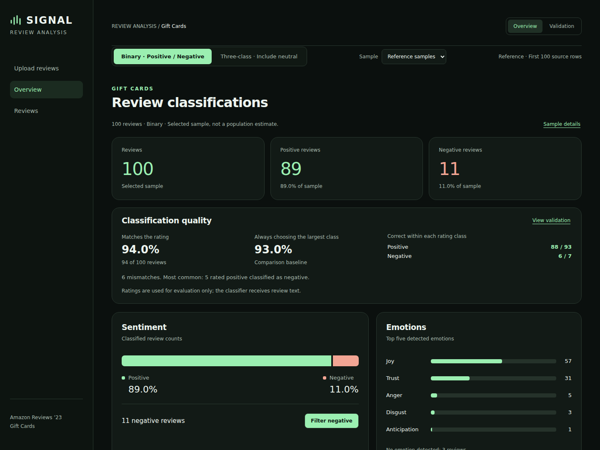

# Applied AI Portfolio

Working AI applications for business and analytics, with reproducible Python workflows, evaluation results, and interactive dashboards.

## Projects

### Signal: review sentiment and emotion analysis

Classify product-review text, inspect sentiment and emotion, and compare predictions with rating-based labels. The project combines a Python classification pipeline, an offline results dashboard, and a deployable CSV upload workspace.

[Project report and code](signal-review-analysis/) · [Dashboard file](signal-review-analysis/dashboard.html) · [Run or deploy](signal-review-analysis/docs/DEPLOYMENT.md)

**What it demonstrates**

- Structured model requests with ratings excluded from inference and separate binary/three-class prompts.
- Reproducible sampling, class-level evaluation, independent NRC emotion scoring, and analysis of model errors.
- A dark-mode interface with filtering, per-review evidence, and CSV export.
- An authenticated Python upload service with deployment configuration and automated checks.

**Key finding:** the first-100 binary run agrees with ratings 94% of the time, only one percentage point above the majority-class baseline. A balanced three-class sample reaches 72% agreement and correctly identifies just 12 of 50 neutral reviews. The report examines why overall accuracy alone is insufficient.

**Try it:** download the repository, extract it, and open `signal-review-analysis/dashboard.html` for the offline reference dashboard. To classify new reviews, follow the deployment guide and configure your own model connection. The GitHub file viewer displays HTML source; it does not run the application. No hosted application is currently linked.

## Repository structure

Each project has its own README, source code, evidence, and instructions. Repository-level GitHub Actions run the applicable project checks. Signal’s report, prompts, balanced raw output, and screenshots are all inside `signal-review-analysis/`.

## Development approach

Projects are developed with AI assistance, with saved evidence and tests used to check the outputs. Limitations and unverified deployment assumptions are documented in each project. Provider credentials, private environment files, and downloaded source archives are excluded.
