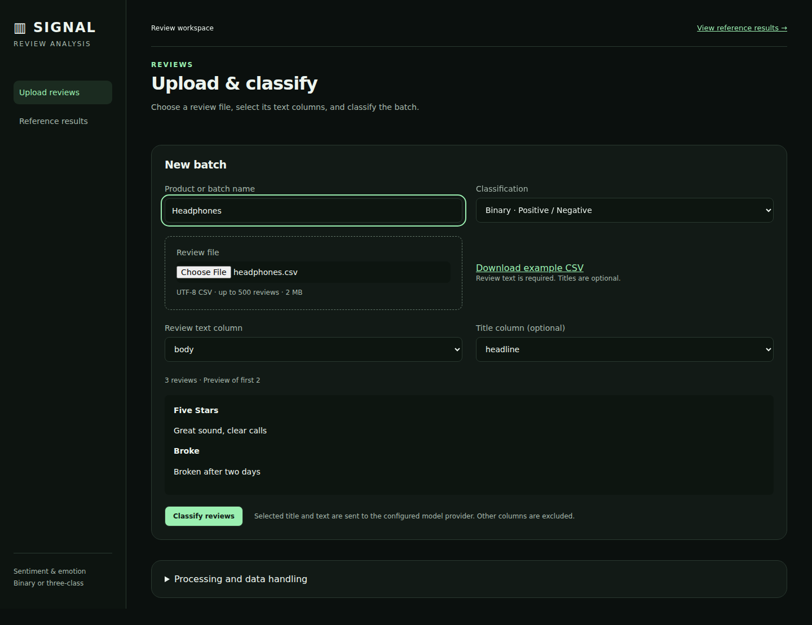

# Signal — review sentiment & emotion

**Classify product reviews from their text, inspect sentiment and emotion, and export the results.** Python handles classification; the browser provides the workspace. Developed with AI assistance and retained model evidence.

## Run the workspace

The upload workspace accepts a UTF-8 CSV for any product, with a required review-text column and optional title column. Binary mode is the default; three-class mode adds neutral. Only the selected text fields enter model requests. Batch progress, failed-row status, search, sentiment filters, and CSV export are included.

Configure the model connection and workspace access token, then run `python server.py` and open `http://localhost:8000`. A Dockerfile and Gunicorn configuration provide a deployable single-instance service. See [deployment and configuration](docs/DEPLOYMENT.md). The provider must support the existing structured-output request schema.

Uploaded data is kept temporarily in memory; this version targets a single owner or trusted team. It does not include individual accounts or durable job storage. No provider credentials are exposed to the browser.



## Reference analysis

Open [dashboard.html](dashboard.html) in a browser. It opens with binary (positive/negative) results for the first 100 reviews: sentiment totals, a compact rating-agreement and class-error summary, common emotions, and searchable reviews. Classification and sample selectors remain visible in both views, including the optional three-class mode. A separate Validation view contains experiment comparisons, scoring, and technical evidence. The reference dashboard works offline; uploaded-review classification uses the Python server and a model connection. Python performs sampling, model requests, scoring, emotion analysis, and report/dashboard generation; HTML/CSS/JavaScript provide the interface.


## Main finding

The reference binary run achieves **94.0%** rating agreement, but simply predicting the majority class achieves **93.0%**. The reference balanced three-class run achieves **72.0%**, with only **12/50** neutral reviews correctly identified. The useful result is the pattern of failures, not the headline accuracy alone.

The dataset contains **152,410** reviews; **88.5%** have four or five stars. The first 100 contain **93** positives and **7** negatives. Negative recall is **6/7 (85.7%)**, while negative precision is **54.5%**. An apparently strong accuracy therefore coexists with less convincing minority-class performance.

## Reference results and error directions

Ratings define the evaluation benchmark: binary 4–5 → positive and 1–3 → negative; three-class 4–5 → positive, 3 → neutral, and 1–2 → negative. **Ratings never enter model requests.** Rows below are rating-derived labels; columns are predictions.

**First 100, binary**

| Actual / Predicted | Positive | Negative |
|---|---:|---:|
| Positive | 88 | 5 |
| Negative | 1 | 6 |

**Stratified 150, three-class**

| Actual / Predicted | Positive | Neutral | Negative |
|---|---:|---:|---:|
| Positive | 48 | 2 | 0 |
| Neutral | 6 | 12 | 32 |
| Negative | 0 | 2 | 48 |

Of the 50 neutrals, **6** become positive and **32** become negative. Positive and negative recall are each **48/50** and **48/50**, respectively. Equal sampling makes neutral-class failure visible. It does not establish whether a mismatch is a model error or a disagreement between the review’s language and its star rating.

Illustrative mismatches follow. Model explanations are generated claims to inspect, not verified reasons:

- **gc-102814 — Leave yourself time to match gifts to recipients!**: rating-derived neutral, predicted negative. The saved explanation says: The reviewer expresses frustration and criticism regarding the disorganized packaging and lack of clear gift-to-recipient matching, culminating in a direct complaint to Amazon.
- **gc-090351 — Attractive box and good gift for friends**: rating-derived neutral, predicted positive. The saved explanation says: The reviewer expresses confidence in the product's value as a gift and praises its attractive appearance, indicating a favorable overall experience.

## Controlled supplementary comparison

The original prompts are frozen and run independently on both identical samples. The two original reference outputs are preserved. No request receives the other task’s answers, and no human labels are required.

| Sample | Task | Role | Agreement | Majority baseline | Macro F1 |
|---|---|---|---:|---:|---:|
| First 100 | Binary | Reference | 94.0% | 93.0% | 0.817 |
| First 100 | Three-class | Supplementary | 95.0% | 93.0% | 0.604 |
| Stratified 150 | Binary | Supplementary | 93.3% | 66.7% | 0.926 |
| Stratified 150 | Three-class | Reference | 72.0% | 33.3% | 0.675 |

The 150-review sample contains 50 reviews per **three-class rating label**. Under binary scoring, it has 50 positives and 100 negatives, hence a different majority baseline. This comparison holds the sample constant when changing task, and the task constant when changing sample. The scoring targets still differ; the table is not a leaderboard of interchangeable classifiers.

Holding the binary task fixed, agreement is **94.0%** on the first sample and **93.3%** on the stratified sample. For three-class scoring, it is **95.0%** versus **72.0%**. Crucially, the high first-100 three-class score hides **0/2** neutral reviews correctly identified. The extra runs expose a specific neutral-class weakness rather than treating every difference as an effect of balancing.

On the same stratified reviews, **132** retain their polarity, **16** become neutral, and **2** switch between positive and negative when moving from the binary prompt to the three-class prompt. These are paired prediction descriptions, not causal estimates; calls used the same named model/settings at different times.

The three-class agreement’s approximate **95% sampling interval is 67.3%–76.7%**, using 10,000 bootstrap resamples within the original rating strata, seed 6419. Per-class intervals appear in the dashboard. They assume independent reviews within strata and describe the designed mixture, not population-prevalence accuracy, benchmark validity, or model-run variability. No population intervals are reported for the ordered first-100 sample. [Method and limitations](docs/DECISIONS.md).

## Emotion comparison and tie sensitivity

On the reference balanced run, exact primary-emotion agreement is **26/150 (17.3%)**. NRC produces **75** maximum-score ties and **32** no-signal reviews. It counts word occurrences across eight emotions without stemming, negation, or sarcasm handling; the LLM considers context. Alphabetical tie-breaking selects a single NRC primary label, and no matched emotion word produces `none`.

Restricting **both** sensitivity measures to the **118** reviews with NRC signal, exact agreement is **19/118 (16.1%)**. Accepting any tied highest-scoring emotion raises compatibility to **41/118 (34.7%)**: **22** additional cases depend on which tied label is selected. This relaxed measure is not emotion accuracy and does not replace the required primary-label comparison. Neither method has human emotion ground truth.

## Engineering choices, issues, and checks

Explicit rating phrases are masked in title/text; original text and exact masked input remain inspectable. The binary prompt uses a documented negative fallback for genuinely balanced/factual/no-evidence reviews. Temperature 0 and fixed seeds improve repeatability, while saved responses remain authoritative because inference can still vary.

An initial response failed schema validation despite JSON-object mode. We switched to strict output enums/schema and reran both original experiments consistently. Checkpoint handling was fixed to retain completed work when another review fails. A browser installer returned a truncated archive; a working browser binary enabled real interface testing. Browser assertions separately read confusion-cell counts and percentages to avoid concatenating them during validation.

Python checks verify request isolation, masks, mappings, raw responses, all four samples, tie behavior, paired transitions, and reproducible uncertainty. Reference-dashboard browser checks compare displayed figures and filters against saved output, inspect small bars and mobile overflow, and confirm zero network requests. Separate upload tests exercise the browser-to-Python-to-provider request path using a local simulated endpoint. GitHub Actions is configured to verify and rebuild the saved project without credentials; remote CI status is only established after publication.

See the [requirements review](docs/REQUIREMENTS_REVIEW.md) for the evidence checklist and remaining publication/author-review steps.

Publication notes and deployment boundaries are documented in [SECURITY.md](SECURITY.md). The inference endpoint is configured privately; public experiment metadata omits its address.

## Reproduce and inspect

```sh
python -m unittest discover -p 'test_*.py' -v
python verify_results.py
python dashboard.py
python report.py
```

Python 3.10+; local use and offline analysis require no third-party Python dependencies. Linux deployment uses the pinned server dependency in `requirements-server.txt`. [Full reproduction instructions and file map](docs/REPRODUCING.md) · [Decision log and architecture](docs/DECISIONS.md). Upload calls use an explicitly configured model endpoint and environment-supplied key. Downloaded source data, the NRC lexicon, credentials, and checkpoints are excluded from the repository.

The upload service is tested with a local simulated provider. A real provider connection must be configured and verified before hosting; no live deployment is claimed.

## Sources

- McAuley Lab, UC San Diego: [Amazon Reviews ’23](https://amazon-reviews-2023.github.io/) and [Gift Cards source file](https://mcauleylab.ucsd.edu/public_datasets/data/amazon_2023/raw/review_categories/Gift_Cards.jsonl.gz). Hou et al. (2024), *Bridging Language and Items for Retrieval and Recommendation*.
- This project uses the [NRC Word-Emotion Association Lexicon](https://saifmohammad.com/WebPages/NRC-Emotion-Lexicon.htm), created by Saif M. Mohammad and Peter D. Turney at the National Research Council Canada. Mohammad & Turney (2013), *Crowdsourcing a Word–Emotion Association Lexicon*, Computational Intelligence 29(3), 436–465. The lexicon is downloaded separately for educational use and is not redistributed.
