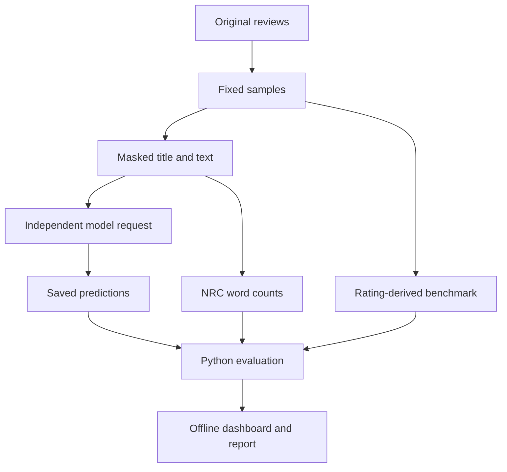

# Analytical and engineering decisions

| Decision | Why | Limitation / trade-off |
|---|---|---|
| Customer overview first, validation in a secondary view | Makes the dashboard useful for exploring feedback without requiring statistical vocabulary | Selected-sample scope remains visible; reliability and technical evidence are one click away |
| Python analysis, standalone HTML interface | Keeps analysis in Python and reference results available offline | New predictions use the Python upload service |
| Rating-derived labels remain the benchmark | Preserves the original evaluation rule | Rating agreement is not independently labeled sentiment accuracy |
| Frozen prompts, one review per request | Prevents answer sharing or neutral-label examples from entering binary calls | Shared server behavior can vary; no claim of bitwise inference determinism |
| Mask explicit star-rating phrases in review text | Prevents obvious textual copies of the rating from leaking into classification | Heuristic masking is incomplete and can remove the only evaluative information |
| Fixed forced-binary fallback for balanced/factual text | Makes a two-label task operational without silently returning neutral | Choosing negative for such cases can introduce directional bias |
| Two prompts crossed with two fixed samples | Holds input reviews constant when examining prompt/task differences | Scoring targets differ; calls occurred at different times, not in a randomized trial |
| Preserve the original two experiment outputs | Maintains a transparent record of the original evaluation stages | Supplementary runs do not retrospectively improve those results |
| NRC counts occurrences, without stemming or negation rules | Keeps the required word-list baseline transparent | Context, morphology, negation, and sarcasm can produce errors |
| Alphabetical tie-break, plus a separate top-set measure | Required primary labels remain deterministic; sensitivity is visible | Top-set compatibility is easier to satisfy and is not a replacement accuracy score |
| Exclude no-signal rows from both tie-sensitivity denominators | Avoids counting eight zero scores as eight candidate emotions | Overall exact agreement is reported separately and includes `none` matches |
| Bootstrap within original rating strata | Preserves 50/50/50 sampling, including the binary run's merged negative class | Approximate percentile intervals assume independent reviews and can have limited coverage |
| No population intervals for first 100 source rows | Avoids presenting an ordered convenience sample as random | Results describe this batch only |
| No manual labels or prompt optimization loop | Keeps autonomous classification separate from evaluation | Human validation and held-out prompt refinement are future work |
| Separate public outputs from source downloads and credentials | Makes the repository small, inspectable, and reproducible | Data and NRC lexicon require downloads for new analysis |

## Data flow and separation

Ratings affect sampling and evaluation, never the model request or word-list scores. The reference dashboard does not call the model or revise predictions. The upload workspace sends batches to a Python service, which uses the same independent prompts and rating-phrase masking. Model explanations are generated claims, not verified causal accounts.

## What the uncertainty does and does not mean

The supplementary analysis draws 10,000 bootstrap samples with replacement, separately within each original rating-derived class, using seed 6419. Each replicate preserves 50 positive, 50 neutral, and 50 negative source labels. Python recalculates all metrics per replicate; the 2.5th and 97.5th percentiles form approximate 95% intervals.

These intervals describe sampling variability under the designed equal-stratum mixture and fixed saved predictions. They do not describe full-corpus accuracy under its much more positive prevalence, label validity, model-call variability, server changes, or uncertainty due to repeated reviewers/products. Independence within strata is an approximation; no cluster correction is performed. Percentile intervals are transparent but do not guarantee nominal coverage in small samples, especially near boundary rates.

The main report keeps the original rating-derived score authoritative. A neutral prediction's availability changes the classification task, so the four-run table should not be read as a ranking of interchangeable classifiers.

Method reference: [SciPy bootstrap documentation](https://docs.scipy.org/doc/scipy/reference/generated/scipy.stats.bootstrap.html), including its limitations and distinction between percentile and other intervals. The implementation here uses Python's standard library and stratifies explicitly; SciPy is not a runtime dependency.
